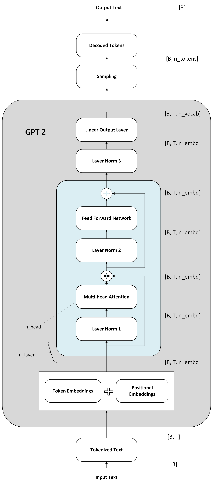

If you haven't already seen Jay Mody's
[GPT-2 in 60 lines of NumPy](https://jaykmody.com/blog/gpt-from-scratch/),
please read that first. It's a really detailed explanation and I learnt a ton
from it.

I'm [forking that repo](https://github.com/firozgit/picoGPT) (MIT-licensed) and adding a few things on top, and
sharing what I learn along the way. I'm also adding assertions and testing tools as I go, to check
that what I'm coding is actually right and that I'm heading in the right
direction. That part matters more than it sounds like it should — inference bugs
tend not to crash. They just quietly give you slightly different text.

The plan:

- **this post** — batching
- **post 2** — batching with variable length: padding, and modifying the masks accordingly
- **post 3** — KV cache
- **post 4** — sampling methodology
- After that? Ask me when I get there

## Recap of the code

Here's the shape of what Jay Mody's version does, top to bottom:

```
Encoding to tokens
Generate token by token
    GPT2
        Token embedding + position embedding
        Transformer blocks
            pre-norm multi-head attention
                QKV projections
                split into multiple heads
                get output using attention
                merge heads
                output projection
            pre-norm MLP
                project up
                activation
                project down
        layer norm
        projection to vocab
    Sampling
Decoding to text
```

Everything in this series changes only the shapes flowing through that, not the
structure.

## The params and hparams

Also to recap, here are the params and hparams of GPT-2 124M:

```python
{'wte': [50257, 768],                                  # token embeddings
 'wpe': [1024, 768],                                   # position embeddings
 'blocks': [{'ln_1': {'g': [768], 'b': [768]},
             'attn': {'c_attn': {'w': [768, 2304], 'b': [2304]},
                      'c_proj': {'w': [768,  768], 'b': [768]}},
             'ln_2': {'g': [768], 'b': [768]},
             'mlp':  {'c_fc':   {'w': [768, 3072], 'b': [3072]},
                      'c_proj': {'w': [3072, 768], 'b': [768]}}},
            ...                                        # x n_layer = 12
           ],
 'ln_f': {'g': [768], 'b': [768]}}
```

```python
{'n_vocab': 50257, 'n_ctx': 1024, 'n_embd': 768, 'n_head': 12, 'n_layer': 12}
```

A few things worth reading off that:

- `2304 = 3 × 768` — Q, K and V are one fused projection, which is why `mha`
  starts with a single `linear` followed by `np.split(x, 3, axis=-1)`.
- `3072 = 4 × 768` — the MLP's 4× expansion. `c_fc` goes up, `c_proj` comes back
  down, which is why their `w` shapes are mirror images.
- `d_head = 768 / 12 = 64`.
- **Nothing in here is per-head.** There are no 12 sets of attention weights. The
  heads are a *view* of the 768 dimensions, which is exactly why `split_heads` is
  a `reshape` and not an indexing operation.
- **There's no output head either.** `x @ wte.T` reuses the token embeddings. At
  38.6M parameters, `wte` is 31% of the model, and tying it means that 31% does
  double duty.


And does it add up?

| | |
|---|---:|
| `wte` | 38,597,376 |
| `wpe` | 786,432 |
| per block | 7,087,872 |
| × 12 blocks | 85,054,464 |
| `ln_f` | 1,536 |
| **total** | **124,439,808** |

## Adding the batch axis

In the original post, the author used a single prompt. Now let's see how to
extend this to a batch of prompts, with no loop over the batch. We introduce a
batch axis `B`.

One thing to be clear about up front: in this post all the prompts in the batch
are the **same length**, so a single `T` describes every prompt in it. Prompts of
different lengths need padding and a modified mask, which is post 2. That's the
only real restriction here — the code below works for any `B`.

All the code below lives in
[`gpt2_v1_batching.py`](https://github.com/firozgit/picoGPT/blob/main/gpt2_v1_batching.py).

Let's go step by step through where the changes happen. @fig-shapes is the whole
thing with the batch axis threaded through — every shape below refers back to it.

{#fig-shapes .diagram .lightbox width=51% fig-align="center" fig-alt="GPT-2 forward pass as a block diagram, annotated with tensor shapes at each step: input text of shape B, tokenized to B by T, embedded to B by T by n_embd, through n_layer transformer blocks each with layer norm, multi-head attention, a residual add, layer norm, feed forward network and another residual add, then a final layer norm, a linear output layer to B by T by n_vocab, sampling, and decoded tokens of shape B by n_tokens."}


### generate

The logits now come back for every prompt in the batch, so the shape is
`[B, T, n_vocab]`.

We're still doing greedy decoding, but we have to take the last position of each
prompt in the batch — hence `logits[:, -1]` — and then concatenate the new tokens
onto the input all at once with `np.concatenate`. `next_ids[:, None]` is there to turn `[B]` back into `[B, 1]` so it can be
concatenated along the time axis.

```python
def generate(input_ids, params, n_head, n_tokens_to_generate):
    # input_ids: [B, T]
    for _ in tqdm.tqdm(range(n_tokens_to_generate)):
        logits = gpt2(input_ids, **params, n_head=n_head)   # [B, T, n_vocab]
        next_ids = np.argmax(logits[:, -1], axis=-1)        # greedy: [B]
        input_ids = np.concatenate([input_ids, next_ids[:, None]], axis=-1)

    return input_ids[:, -n_tokens_to_generate:]             # [B, n_tokens_to_generate]
```

### gpt2

`wpe` can be customised per sequence when the sequences have different lengths,
but here every prompt has the same length, so we just take `T` and let it
broadcast over the batch. (For prompts of different lengths we'd take the max
token length and pad — post 2.)

Everything else stays the same, except that a batch dimension has been added to
each matrix.

```python
def gpt2(input_ids, wte, wpe, blocks, ln_f, n_head):
    # input_ids: [B, T]
    T = input_ids.shape[-1]

    # token embedding [B, T, n_embd] + position embedding [T, n_embd] (broadcasts over B)
    x = wte[input_ids] + wpe[np.arange(T)]

    for block in blocks:
        x = transformer_block(x, **block, n_head=n_head)   # [B, T, n_embd] -> [B, T, n_embd]

    x = layer_norm(x, **ln_f)                              # [B, T, n_embd]

    return x @ wte.T   # [B, T, n_embd] @ [n_embd, n_vocab] -> [B, T, n_vocab]
```

### transformer_block

Again the code is unchanged apart from the batch dimension being carried along.

```python
def transformer_block(x, mlp, attn, ln_1, ln_2, n_head):
    # pre-norm multi-head attention
    x = x + mha(layer_norm(x, **ln_1), **attn, n_head=n_head)   # [B, T, n_embd]
    # pre-norm feed forward
    x = x + ffn(layer_norm(x, **ln_2), **mlp)                   # [B, T, n_embd]
    return x
```

`linear`, `layer_norm`, `softmax`, `gelu` and `ffn` need no changes at all. They
already reduce over `axis=-1` with `keepdims=True`, and `@` broadcasts over any
number of leading dimensions, so they work on `[T, d]`, `[B, T, d]` or
`[B, H, T, d]` without touching them. If any of them had been written with a
positive axis index — `np.mean(x, axis=1)`, which is a perfectly natural thing to
write when `x` is 2-D — every one would need editing now.

### mha

This is where more of the changes happen.

With the extra batch dimension, we need to split the heads accordingly using
`reshape` and `transpose`. And instead of calculating attention for each head in
a Python loop, we calculate all of them at once. Once attention is computed, we
convert the output back to `[B, T, n_embd]` by merging the heads. 


```python
def mha(x, c_attn, c_proj, n_head):
    # x: [B, T, n_embd]
    B, T, n_embd = x.shape
    d_head = n_embd // n_head

    x = linear(x, **c_attn)             # [B, T, n_embd] -> [B, T, 3 * n_embd]
    q, k, v = np.split(x, 3, axis=-1)   # each [B, T, n_embd]

    # split the feature axis into heads, then move heads next to batch:
    # [B, T, n_embd] -> [B, T, H, d_head] -> [B, H, T, d_head]
    def split_heads(t):
        return t.reshape(B, T, n_head, d_head).transpose(0, 2, 1, 3)

    q, k, v = split_heads(q), split_heads(k), split_heads(v)

    # causal mask: 0 where j <= i, -1e10 where j > i. [T, T]
    mask = (1 - np.tri(T, dtype=x.dtype)) * -1e10

    # one batched call handles every (batch, head) pair
    out = attention(q, k, v, mask)      # [B, H, T, d_head]

    # merge heads back: [B, H, T, d_head] -> [B, T, H, d_head] -> [B, T, n_embd]
    x = out.transpose(0, 2, 1, 3).reshape(B, T, n_embd)

    x = linear(x, **c_proj)             # [B, T, n_embd] -> [B, T, n_embd]
    return x
```

### attention

To accommodate the multi-head calculation, we swap the axes of `k`, do the scaled
dot product, and return an output matrix of size `[B, H, T, d_head]`.

`np.swapaxes(k, -1, -2)` and not `k.T`. This is the one I'd have got wrong if I
hadn't been watching the shapes: `k` is 4-D now, and `.T` reverses **all four**
axes, giving `[d_head, T, H, B]`. What we want is to swap only the last two. `.T` on anything more than 2-D is almost
always a bug.

```python
def attention(q, k, v, mask):
    # q, k, v: [B, H, T, d_head], mask: [T, T] (broadcasts over B, H)

    # [B, H, T, d_head] @ [B, H, d_head, T] + [T, T] -> [B, H, T, T]
    scores = q @ np.swapaxes(k, -1, -2) / np.sqrt(q.shape[-1]) + mask

    # [B, H, T, T] @ [B, H, T, d_head] -> [B, H, T, d_head]
    return softmax(scores) @ v
```

## Checking it

The claim for this post is narrow: **a batch of one must produce exactly what the
original produces.** Nothing about the math changed, only the shapes.

```python
def test_gpt2_vs_batched_logits():
    expected = gpt2.gpt2(prompt, **params, n_head=n_head)
    actual = gpt2_v1_batching.gpt2(
        prompt[None, :], **params, n_head=n_head
    )[0]

    np.testing.assert_allclose(actual, expected, rtol=1e-12, atol=1e-12)
```

It passes. `prompt[None, :]` adds the batch axis of one, and `[0]` takes the row
back out — so both sides are `[T, n_vocab]` and comparable. The full thing is in
[`test_gpt2.py`](https://github.com/firozgit/picoGPT/blob/main/test_gpt2.py).

It runs against a tiny random model — `n_vocab=17, n_embd=12, n_head=3` — so it
takes a second and doesn't need the 124M download. Equivalence is a property of
the code, not the weights.

A tolerance of `1e-12` is tighter than float32 can represent, so this is really
asking for bit-identical output. Which is the right ask here, because nothing in
this version reorders an arithmetic operation.

## What batching actually buys

Batching doesn't reduce the arithmetic — it reduces how many times you read the
weights to do it. Load each weight matrix once and use it for every sequence in the
batch instead of one. GPUs are fast at math and slow at memory, so this is most of what keeps
them from idling — and why serving systems put many users in the same matmul.

## Where this is going

Next: prompts of different lengths, which means padding, a mask that knows which
positions are real, and position ids that skip the pads. Then a KV cache, then
sampling — and after that, any other methods I can think of.
